<p align="center">
  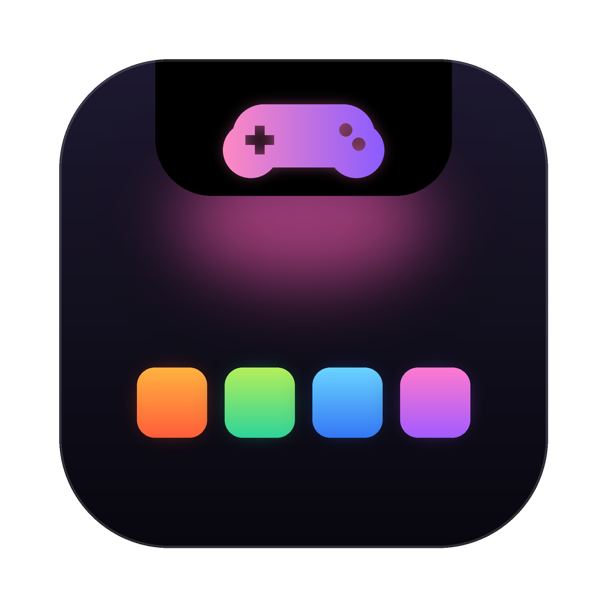
</p>

<h1 align="center">Notcher</h1>

<p align="center"><b>Your notch. Your arcade.</b><br>
Drag a NES or Game Boy ROM onto the MacBook notch and it plays right there. Or hover the notch for 20 built-in mini games. Esc takes you back to work.</p>

---

Notcher turns the notch into a small arcade that behaves like the Dynamic Island. It's built for the half-minute gaps in a workday: waiting on an AI agent, a build, a download or a compile.

**Hover → Choose → Play → Esc → Back to work.**

<p align="center">
  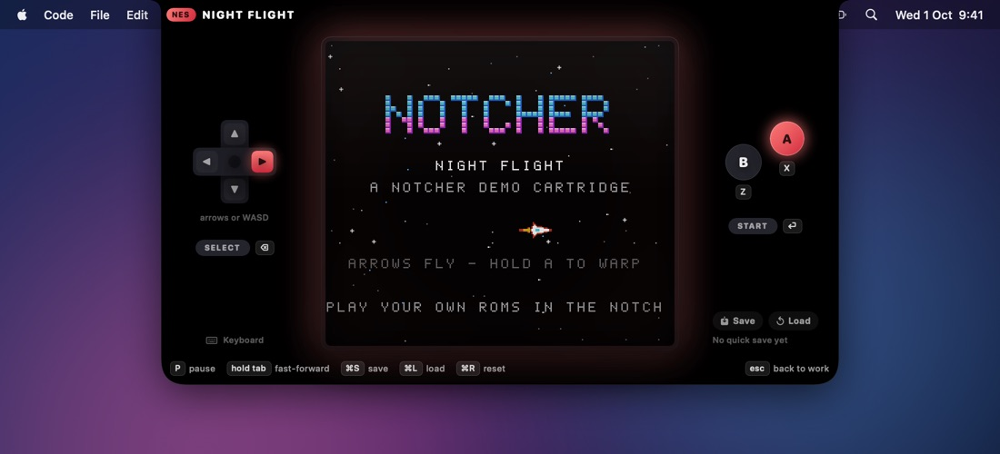
</p>

## Play your own ROMs

<p align="center">
  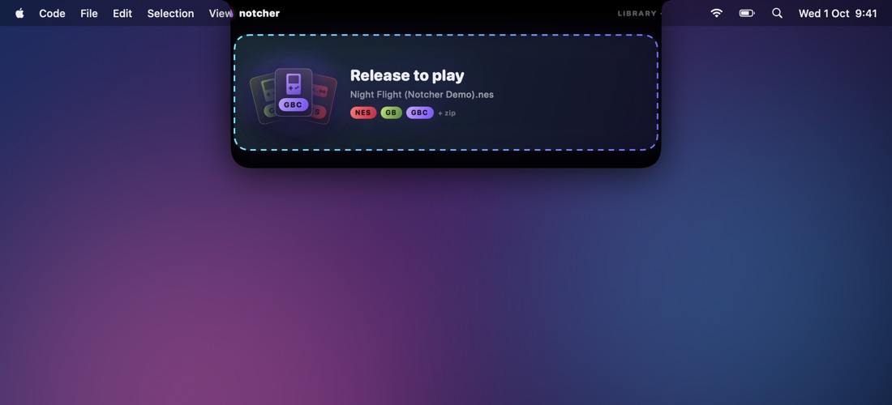
  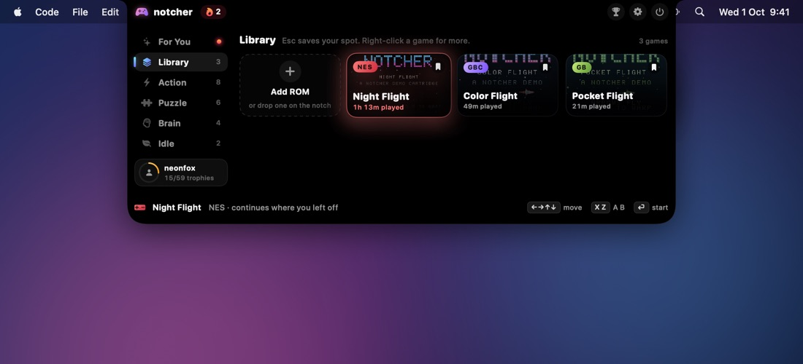
</p>

<p align="center">
  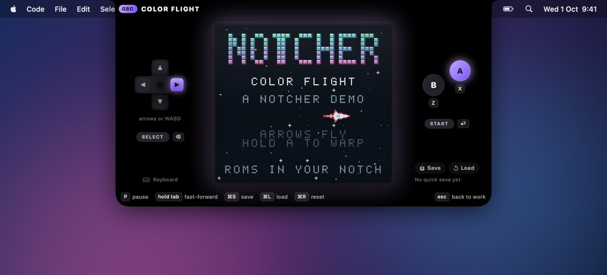
  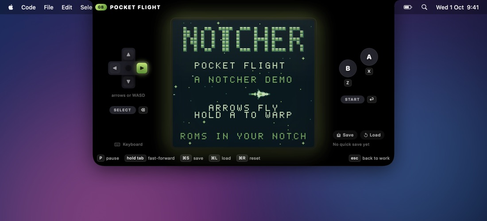
</p>

- **Drag to play.** Drag a `.nes`, `.gb` or `.gbc` file, or a `.zip` with one inside, toward the notch. It opens into a drop target; let go and the game starts. You can also click **Add ROM** in the Library, use **Open ROM…** (⌘O) in the menu bar, or choose **Open With → Notcher** in Finder.
- **A library that remembers.** Every game you add is kept on the Library page, with the last frame you saw as its poster. For You offers a **Continue** card for the game you played last. Right-click a game to start over, show it in Finder or remove it.
- **Esc saves your spot.** Leaving a game snapshots it, and the next launch continues exactly there. Battery saves (the cartridge's own save RAM) are written to disk every few seconds while you play. `⌘S` / `⌘L` give you a quick-save slot on top.
- **Feels like a handheld.** The picture sits in a bezel between a D-pad and A/B buttons that light up as you press them. NES games get soft scanlines, Game Boy games an LCD pixel grid (or switch to sharp pixels in Settings), and original Game Boy games come in classic green or Pocket grey.
- **Keyboard or controller.** Arrows or WASD move, `X` is A, `Z` is B, `↵` is Start, `⌫` is Select, hold `tab` to fast-forward and `P` pauses. Xbox, PlayStation, Switch Pro and MFi controllers work too.
- **Emulators written for Notcher.** Both consoles are emulated in plain Swift: a cycle-accurate 6502 with the NES picture and sound chips, and an SM83 with the Game Boy and Game Boy Color hardware. Emulation runs on its own thread and locks to your display's refresh, and the audio stream adjusts its rate by fractions of a percent to stay in step with the picture. See [Accuracy](#accuracy) for what is covered.
- **Three demo games included.** *Night Flight* (NES), *Color Flight* (GBC) and *Pocket Flight* (GB) are tiny original homebrew games built into Notcher, so there's something to play before you add your own. Click **Try the demos** in the empty Library.

Notcher doesn't include or download any commercial games. Only play ROMs of games you own.

## Built-in games

<p align="center">
  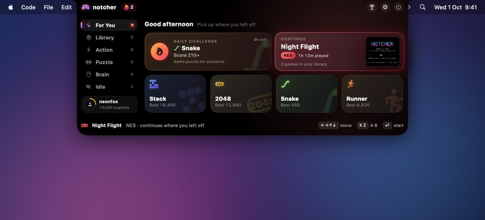
</p>

<p align="center">
  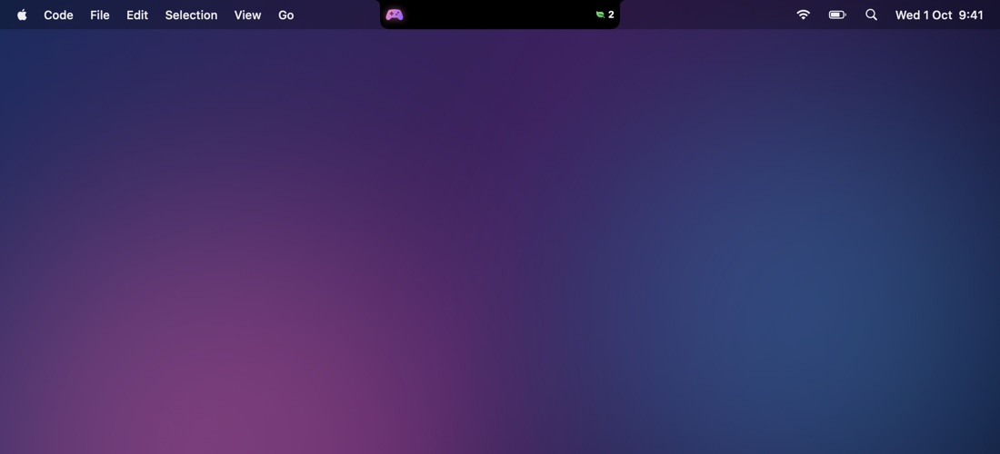
  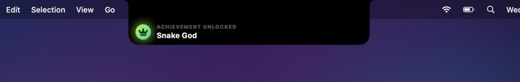
</p>

<p align="center">
  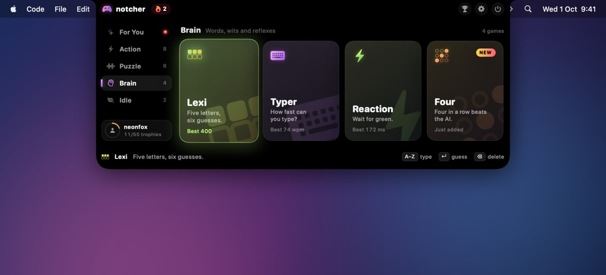
  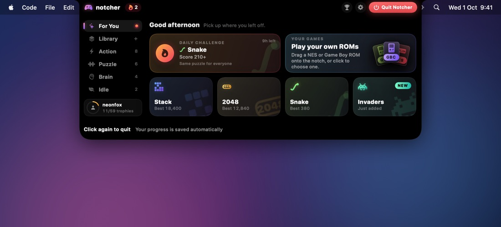
</p>

- **Hover to open.** The notch grows sideways, then down, and the games fade in.
- **Pick a page.** For You shows today's challenge, the ROM you played last and your recent games. Library holds your ROMs; Action, Puzzle, Brain and Idle hold the built-in games. Resting on a page in the sidebar switches to it.
- **Hover to launch.** Rest on a game for 0.3 s and it starts. A ring of light around the tile shows the countdown, and moving away cancels it.
- **Esc to leave.** Esc closes the game and hands keyboard focus back to the app you were in. Clicking anywhere else does the same.
- **Quit from the notch.** The power button in the header asks once, then quits. Settings and the menu bar icon have a Quit button too.
- **No Play button, no loading screen, no account.**

### The games

| | Game | Controls |
|---|---|---|
| ⚡ Action | **Runner**: synthwave endless runner with coins, drones and rising speed | `space` jump (hold for height) · `↓` slide |
| | **Snake**: smooth-moving snake; the arena closes in as you grow | `↑↓←→` |
| | **Pong**: an AI opponent that gets sharper each match you win. First to 5. | `↑↓` |
| | **Breakout**: tough bricks, power-ups (wide, multi-ball, slow, +life) and combos | `←→` · `space` launch |
| | **Invaders** · new: 55 marching aliens, crumbling shields and a mystery saucer | `←→` · `space` fire |
| | **Astro** · new: vector space rocks with drifting physics and hyperspace | `←→` turn · `↑` thrust · `space` fire · `↓` warp |
| | **Trails** · new: light cycles against up to three AI riders that hunt you down | `↑↓←→` |
| | **Arcade**: a cabinet of six micro games (Flap, Dodge, Bullseye, Echo, Lander, Hop), one featured each day | `tab` switch game |
| 🧩 Puzzle | **Stack** · new: falling blocks with hold, ghost piece, 7-bag, wall kicks and back-to-back bonuses | `←→` · `↑` rotate · `space` drop · `C` hold |
| | **2048**: animated slides and merges, with 3 undos | `↑↓←→` · `U` undo |
| | **Gems** · new: match three in 30 moves. Fours make line gems, L and T shapes make bombs, fives make stars | arrows + `space`, click or drag |
| | **Sudoku** · new: freshly generated puzzles with a unique solution, notes and three difficulties | arrows · `1–9` · `F` notes · `⌫` erase · mouse |
| | **Mines**: 20×8 field; the first click is always safe; chording supported | arrows · `↵` reveal · `F` flag · right-click |
| | **Solitaire**: Klondike with drag & drop, double-click to send home, undo and auto-finish | arrows · `↵` pick/drop · `D` draw · `U` undo |
| 🧠 Brain | **Lexi** · new: guess the five-letter word in six tries | type · `↵` guess · `⌫` delete |
| | **Typer** · new: a 30-second typing test with live WPM and accuracy | type · `space` next word |
| | **Reaction**: wait for green, then hit space | `space` |
| | **Four** · new: four in a row against a negamax AI that searches deeper every time you win | `←→` · `space` drop · mouse |
| 🌱 Idle | **Miner**: keeps digging while you work; four upgrade tracks | `space` mine · `↑↓ ↵` upgrade |
| | **Farm**: crops grow in real time, from 30-second wheat to 45-minute starfruit | arrows · `↵` plant/harvest · `tab` seed |

<table>
  <tr>
    <td>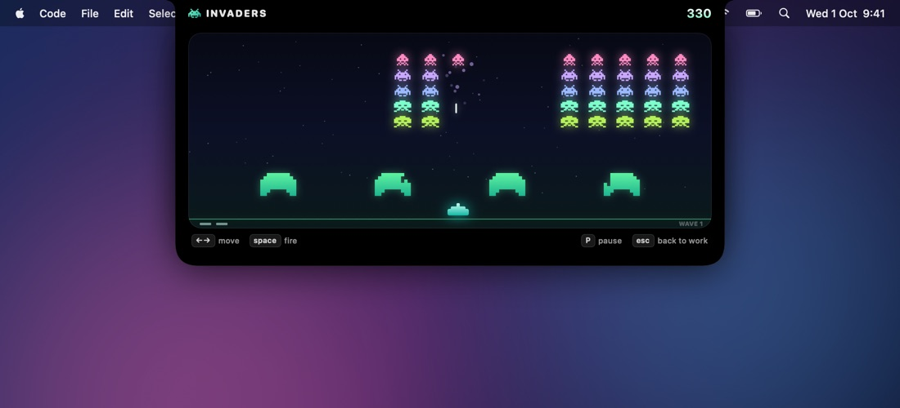</td>
    <td>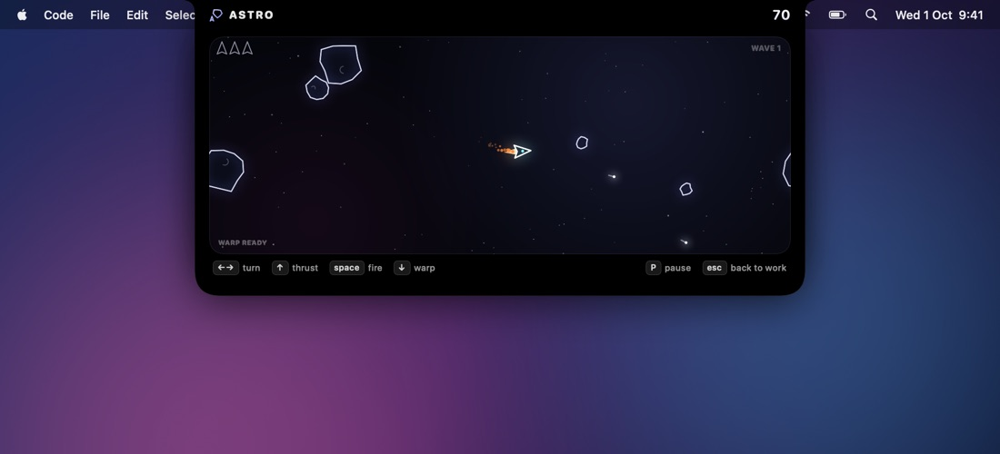</td>
  </tr>
  <tr>
    <td>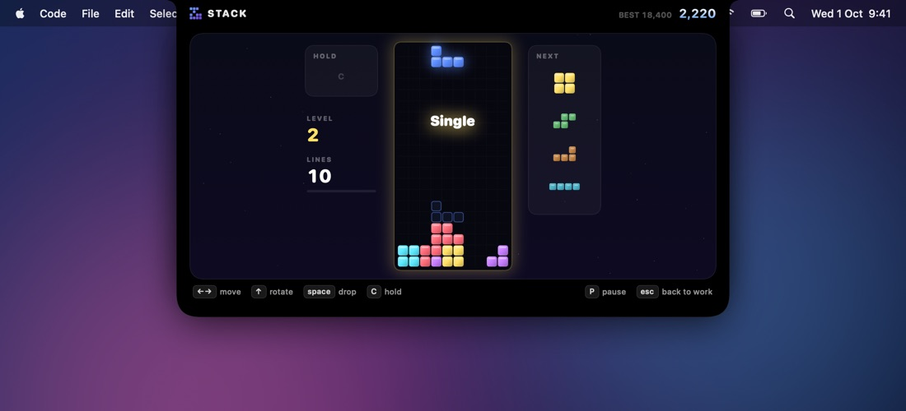</td>
    <td>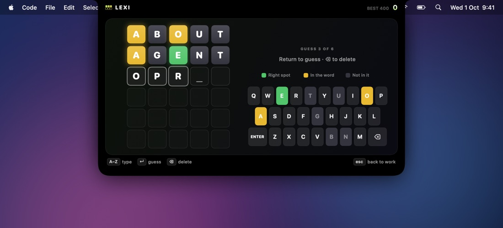</td>
  </tr>
  <tr>
    <td>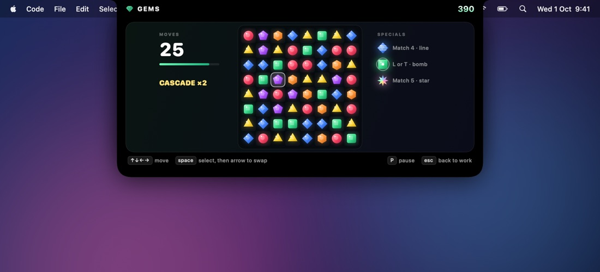</td>
    <td>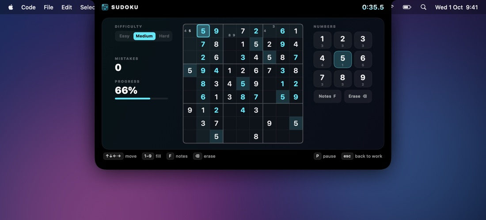</td>
  </tr>
  <tr>
    <td>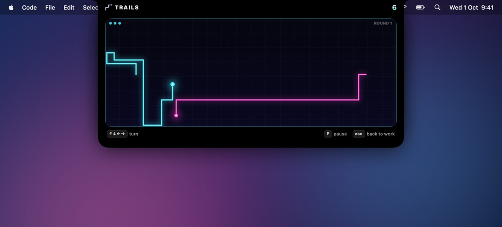</td>
    <td>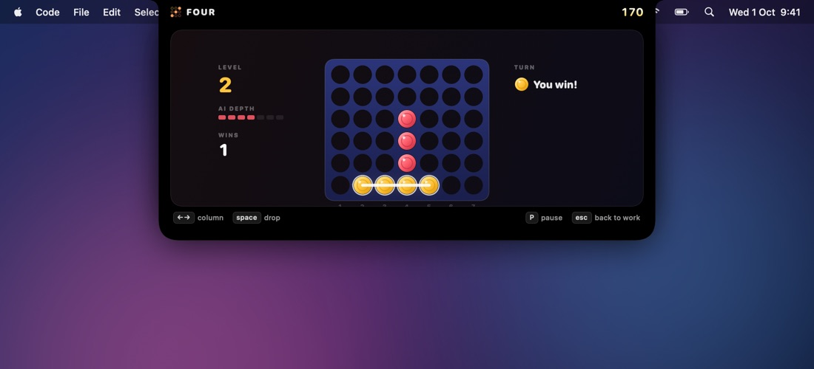</td>
  </tr>
  <tr>
    <td>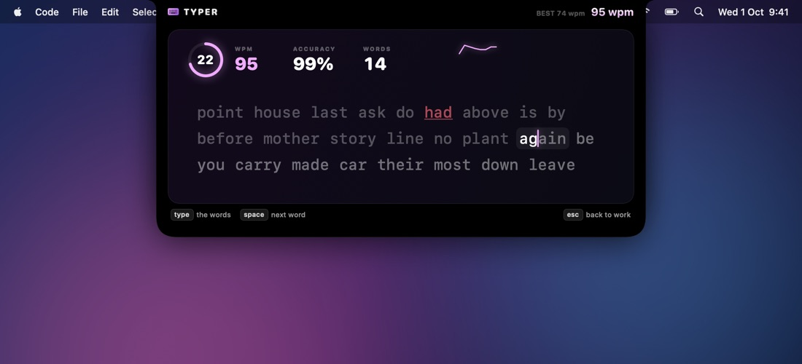</td>
    <td>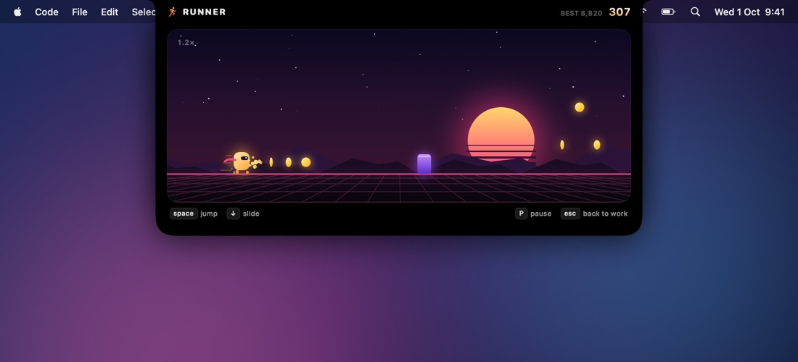</td>
  </tr>
  <tr>
    <td>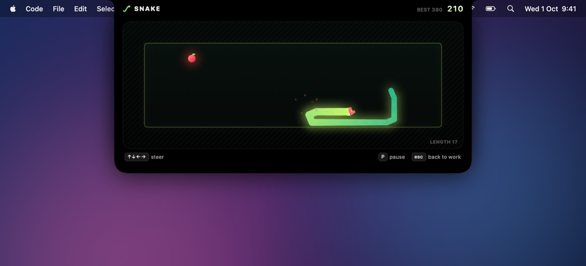</td>
    <td>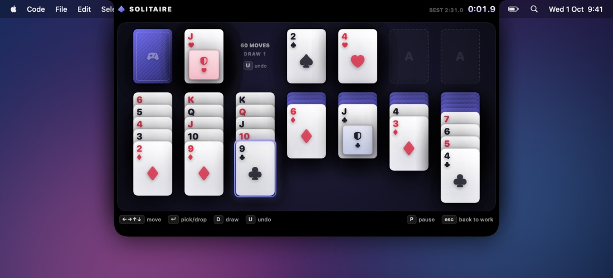</td>
  </tr>
  <tr>
    <td>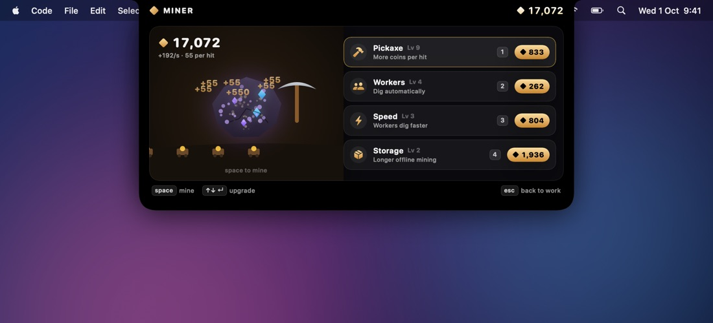</td>
    <td>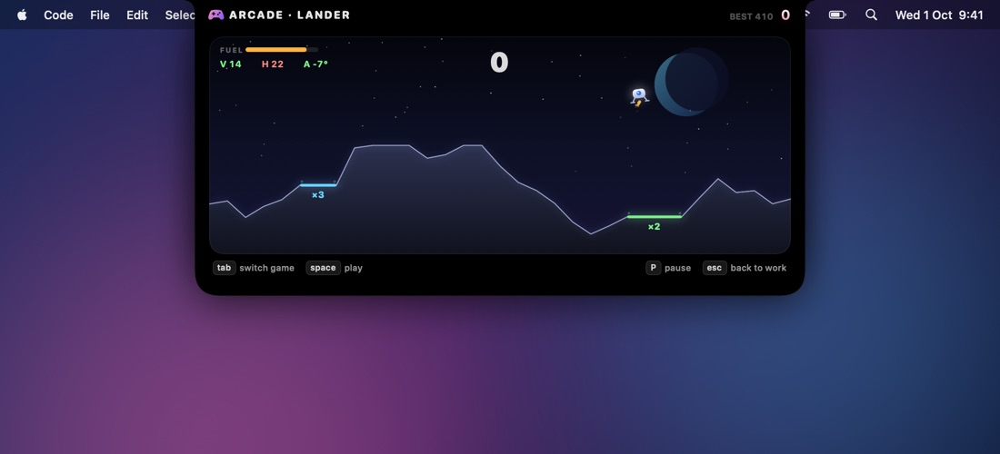</td>
  </tr>
  <tr>
    <td>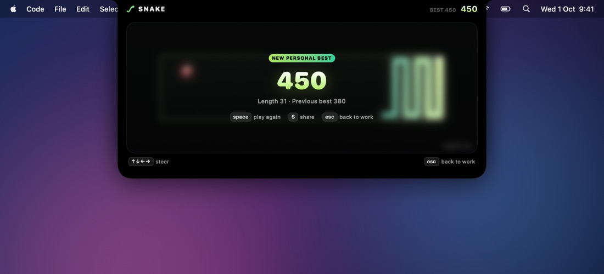</td>
    <td>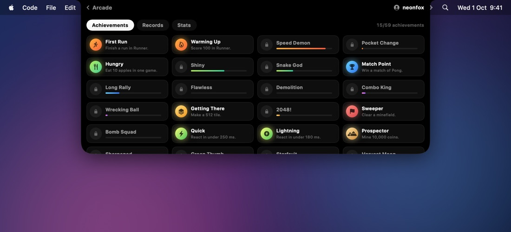</td>
  </tr>
</table>

Keys that work everywhere: `esc` back to work · `P` pause · `R` restart · `M` mute · `S` share score card. In Lexi and Typer, letters type instead.

## Around the games

- **Daily challenge.** Every player gets the same game, seed and target each day, drawn from 14 games. Completed days build a streak 🔥.
- **Personal records.** Best scores, run history and Today / This Week / All Time views for every game and micro game.
- **59 achievements.** Speed Demon, Snake God, Flawless, Card Shark, Genius, Grandmaster, Back to Work (exit with Esc 100 times), Tourist (play all 20 games), Blow on the Cartridge (play one of your ROMs) and more. Each one unlocks with a Dynamic-Island-style toast.
- **Share cards.** After a run, `S` renders a 1200×675 score card, copies it to the clipboard and opens the share sheet.
- **Live ticker.** When the notch is closed, a small stat sits beside it: Miner coins counting up, crops ready on the Farm, or your daily streak.
- **No account.** You get an anonymous ID like `PLAYER-7X42` and can add a nickname if you want one. Everything stays on your Mac.
- **Works without a notch.** On Macs without one, Notcher shows a small pill at the top of the screen that expands the same way.

<p align="center">
  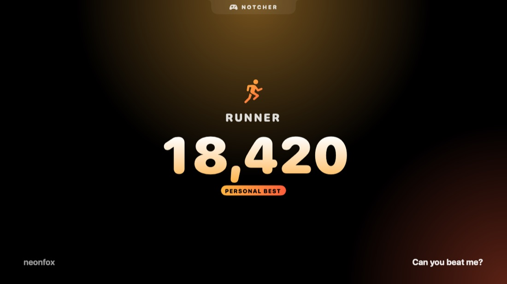
</p>

## Install & run

Requirements: macOS 14 Sonoma or later, Xcode 16+ (Swift 5.9+).

```bash
git clone https://github.com/jeothecreator/Notcher.git
cd Notcher
make run          # builds build/Notcher.app and opens it
```

Other targets: `make app` (build only), `make zip`, `make test`.

To hack on it in Xcode, run `open Package.swift`, choose the **Notcher** scheme and press Run.

Each CI run on macOS also uploads a ready-made `Notcher.zip`. It carries an ad-hoc signature, so macOS may block it the first time. Right-click the app and choose **Open**, or run `xattr -dr com.apple.quarantine Notcher.app`.

Notcher runs as a menu bar agent: no Dock icon, with a 🎮 icon in the menu bar for Settings and Quit. The global shortcut **⌃⌥⌘G** opens the arcade with keyboard focus, and you can change it in Settings.

## How it's built

```
Sources/
├── NotcherCore/            Pure Swift (Foundation only), unit-tested on macOS and Linux
│   ├── Engine/             GameEngine protocol, input, seeded RNG, particles, geometry
│   ├── Games/              20 engines + 6 Arcade micro games, all deterministic state machines
│   ├── Emulation/          NES and Game Boy / Color emulators, ROM library, zip reader, demo cartridges
│   └── Meta/               Catalog, word lists, score book, stats, achievements, daily challenge, save file
└── Notcher/                The macOS app (AppKit + SwiftUI)
    ├── App/                Notch panel, window controller, hotkey, key mapping, app delegate
    ├── Arcade/             ArcadeController (notch state machine, hover-to-launch, drops), GameSession
    ├── Console/            ROM sessions: emulation thread, frame pacing, audio, controllers
    ├── Services/           Sound synthesizer, save store, share cards, prefs
    ├── UI/                 Notch shape, launcher pages, game screen, trophies, settings
    └── Games/              Canvas / SwiftUI renderers for every game
```

- **The notch** is a borderless, non-activating `NSPanel` that sits above the menu bar on every Space, including over full-screen apps. The panel is transparent and passes clicks through everywhere except the visible notch shape. Notch size comes from `NSScreen.safeAreaInsets` and `auxiliaryTopLeftArea` / `auxiliaryTopRightArea`.
- **Hover** uses global mouse tracking, so it works while another app is active and needs no Accessibility permission. **Focus**: launching a game makes the panel key, and Esc re-activates the app you came from.
- **Keyboard navigation** in the launcher is spatial: arrows move to the nearest item in that direction, across the sidebar, header and grid, and `tab` flips pages.
- **Game loop.** A `CADisplayLink` ticks the active engine, which runs at 120 Hz on ProMotion displays. Engines emit events (sounds, stats, records, screen shake), and the app turns those into audio, achievements and personal records.
- **Sound** is synthesized at launch with `AVAudioEngine`. The app ships no audio files.
- **Persistence** is one JSON file in `~/Library/Application Support/Notcher/`. Decoding is tolerant, so updates never wipe your progress. ROMs live next to it in `Library/`, with their battery saves, resume states and posters.
- **Drag and drop.** The panel normally lets clicks through, so it watches the drag pasteboard's types (never its contents) while a mouse button is held. When files are dragged near the notch it starts accepting mouse events there and shows the drop target.

## Accuracy

The emulators are checked against the standard community test ROMs on every push (`Scripts/fetch-test-roms.sh` downloads them; they aren't stored in the repo):

| Test | Result |
|---|---|
| Blargg `cpu_instrs` (Game Boy, all 11) | passes |
| Blargg `instr_timing` (Game Boy) | passes |
| Blargg `mem_timing` (Game Boy) | passes |
| Blargg `official_only` (NES, all 16) | passes |
| `nestest` (NES, every instruction against the reference log) | matches |

Cartridge hardware:

- **NES:** NROM, MMC1, UxROM, CNROM, MMC3, AxROM, Color Dreams and GxROM (mappers 0, 1, 2, 3, 4, 7, 11 and 66), which covers most of the licensed library. Others are recognized and named when you add them.
- **Game Boy / Color:** ROM only, MBC1, MBC2, MBC3 (with its real-time clock) and MBC5, which covers nearly every game.

## Screenshots

The images in this README are rendered by the app itself:

```bash
.build/release/Notcher --render-previews previews/
```

That command plays every game for a few seconds with a small autopilot, flies the demo cartridges through their emulators, and writes each notch state to a PNG. CI runs it on every push and attaches the results as the `Notcher-previews` artifact.

## Tests

```bash
swift test
```

The core suite covers the emulators (CPU instructions and timing, PPU rendering, sprites, scrolling, mappers, save states, battery RAM, the demo cartridges end to end), the ROM library and zip reader, engine rules (Stack rotation, line clears and hold; Sudoku generation with a unique solution; Gems swaps and special gems; Lexi letter marking with repeated letters; Four's AI taking wins and blocking threats; 2048 merges; Mines flood fill and chording; Solitaire moves, undo and auto-finish), the economies (Miner offline income cap, Farm growth), score books, achievements, daily challenges and save compatibility. It runs on both Linux and macOS in CI.

---

<p align="center"><i>Hover. Play. Esc. Back to work.</i></p>
