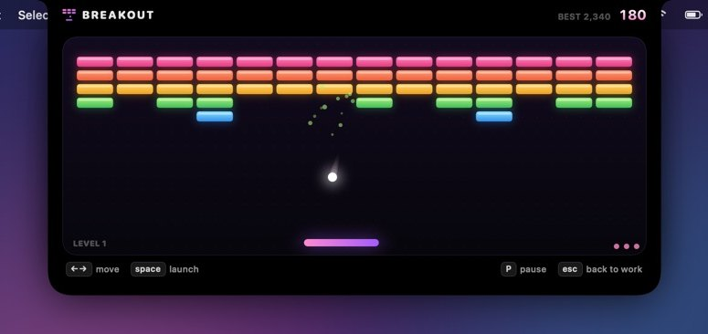
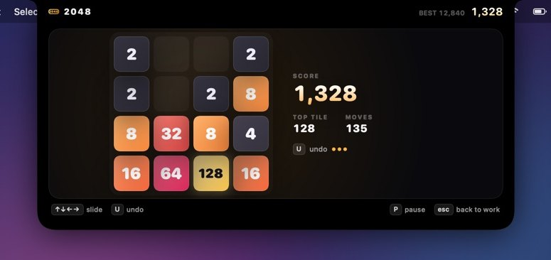
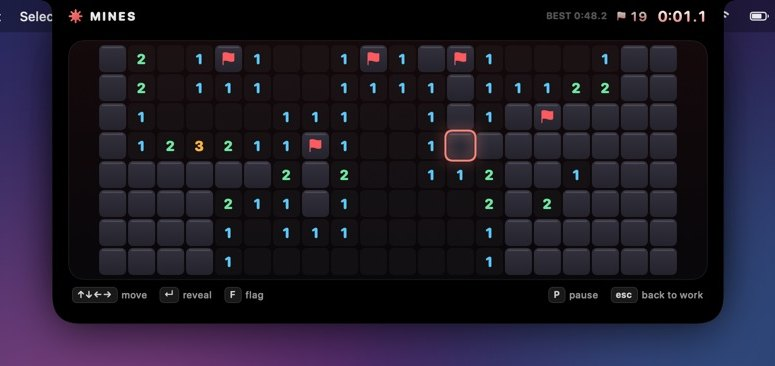
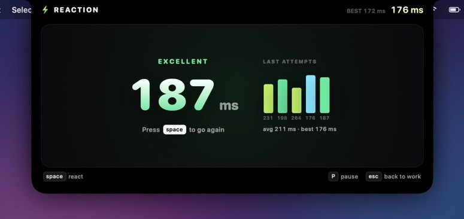
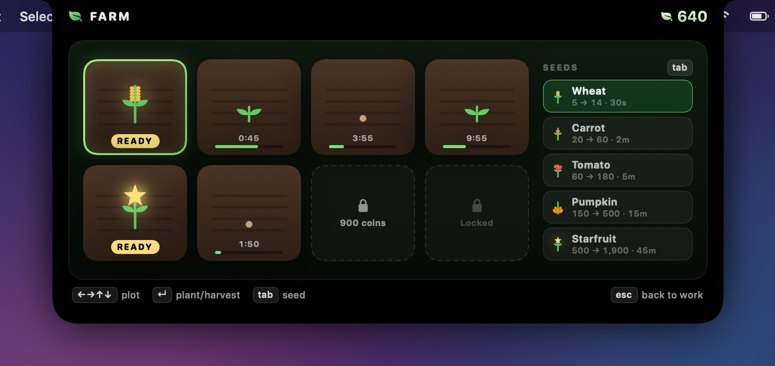
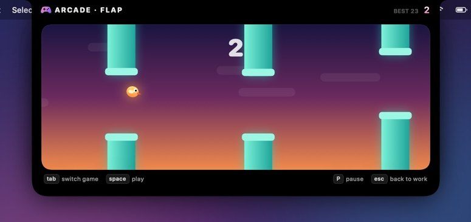

<p align="center">
  
</p>

<h1 align="center">Notcher</h1>

<p align="center"><b>Your notch. Your arcade.</b><br>
Hover the MacBook notch to play one of 11 keyboard-first mini games, then hit Esc to go back to work.</p>

---

Notcher turns the notch into a small arcade that behaves like the Dynamic Island. It's built for the half-minute gaps in a workday: waiting on an AI agent, a build, a download or a compile.

**Hover → Choose → Play → Esc → Back to work.**

<p align="center">
  
</p>

<p align="center">
  
  
</p>

- **Hover to open.** The notch grows sideways, then down, and the games fade in.
- **Hover to launch.** Rest on a game for 0.3 s and it starts. A ring of light around the tile shows the countdown, and moving away cancels it.
- **Esc to leave.** Esc closes the game and hands keyboard focus back to the app you were in. Clicking anywhere else does the same.
- **No Play button, no loading screen, no account.**

## The games

| | Game | Controls |
|---|---|---|
| ⚡ Quick | **Runner**: synthwave endless runner with coins, drones and rising speed | `space` jump (hold for height) · `↓` slide / fast-fall |
| | **Snake**: smooth-moving snake; the arena closes in as you grow | `↑↓←→` |
| | **Pong**: an AI opponent that gets sharper each match you win. First to 5. | `↑↓` |
| | **Breakout**: tough bricks, power-ups (wide, multi-ball, slow, +life) and combos | `←→` · `space` launch |
| 🧠 Brain | **2048**: animated slides and merges, with 3 undos | `↑↓←→` · `U` undo |
| | **Mines**: 20×8 field; the first click is always safe; chording supported | arrows · `↵` reveal · `F` flag · right-click |
| | **Reaction**: wait for green, then hit space | `space` |
| 🌱 Idle | **Miner**: keeps digging while you work; four upgrade tracks | `space` mine · `↑↓ ↵` / `1–4` upgrade |
| | **Farm**: crops grow in real time, from 30-second wheat to 45-minute starfruit | arrows · `↵` plant/harvest · `tab` seed · `A` harvest all |
| 🎴 Classics | **Solitaire**: Klondike with drag & drop, double-click to send home, undo and auto-finish | arrows · `↵` pick/drop · `D` draw · `A` auto · `U` undo |
| | **Arcade**: a rotating cabinet of micro games (Flap, Dodge, Bullseye, Echo), with a different one featured each day | `tab` switch game |

<table>
  <tr>
    <td></td>
    <td></td>
  </tr>
  <tr>
    <td></td>
    <td></td>
  </tr>
  <tr>
    <td></td>
    <td></td>
  </tr>
  <tr>
    <td></td>
    <td></td>
  </tr>
  <tr>
    <td></td>
    <td></td>
  </tr>
  <tr>
    <td></td>
    <td></td>
  </tr>
</table>

Keys that work everywhere: `esc` back to work · `P` pause · `R` restart · `M` mute · `S` share score card.

## Around the games

- **Daily challenge.** Every player gets the same game, seed and target each day. Completed days build a streak 🔥.
- **Leaderboards.** Local Today, This Week and All Time boards for every game. Global boards are optional (see below).
- **34 achievements.** Speed Demon, Snake God, Flawless, Card Shark, Back to Work (exit with Esc 100 times), Professional Procrastinator and more. Each one unlocks with a Dynamic-Island-style toast.
- **Share cards.** After a run, `S` renders a 1200×675 score card, copies it to the clipboard and opens the share sheet.
- **Live ticker.** When the notch is closed, a small stat sits beside it: Miner coins counting up, crops ready on the Farm, or your daily streak.
- **No account.** You get an anonymous ID like `PLAYER-7X42` and can add a nickname if you want one.
- **Works without a notch.** On Macs without one, Notcher shows a small pill at the top of the screen that expands the same way.

## Install & run

Requirements: macOS 14 Sonoma or later, Xcode 16+ (Swift 5.9+).

```bash
git clone https://github.com/jeothecreator/Notcher.git
cd Notcher
make run          # builds build/Notcher.app and opens it
```

Other targets: `make app` (build only), `make zip`, `make test`.

To hack on it in Xcode, run `open Package.swift`, choose the **Notcher** scheme and press Run.

Each CI run on macOS also uploads a ready-made `Notcher.zip`. It carries an ad-hoc signature, so macOS may block it the first time. Right-click the app and choose **Open**, or run `xattr -dr com.apple.quarantine Notcher.app`.

Notcher runs as a menu bar agent: no Dock icon, with a 🎮 icon in the menu bar for Settings and Quit. The global shortcut **⌃⌥⌘G** opens the arcade with keyboard focus, and you can change it in Settings.

## Optional: global leaderboards

1. Create a free [Supabase](https://supabase.com) project.
2. Run [`Backend/supabase.sql`](Backend/supabase.sql) in its SQL editor.
3. In Notcher → Settings → Global leaderboards, paste the project URL and the public API key.

Scores are then submitted automatically, and the Trophies page gains a **Global** tab.

## How it's built

```
Sources/
├── NotcherCore/            Pure Swift (Foundation only), unit-tested on macOS and Linux
│   ├── Engine/             GameEngine protocol, input, seeded RNG, particles, geometry
│   ├── Games/              11 engines + 4 Arcade micro games, all deterministic state machines
│   └── Meta/               Catalog, score book, stats, achievements, daily challenge, save file
└── Notcher/                The macOS app (AppKit + SwiftUI)
    ├── App/                Notch panel, window controller, hotkey, key mapping, app delegate
    ├── Arcade/             ArcadeController (notch state machine, hover-to-launch), GameSession
    ├── Services/           Sound synthesizer, save store, share cards, leaderboard client, prefs
    ├── UI/                 Notch shape, launcher, game screen, trophies, settings
    └── Games/              Canvas / SwiftUI renderers for every game
```

- **The notch** is a borderless, non-activating `NSPanel` that sits above the menu bar on every Space, including over full-screen apps. The panel is transparent and passes clicks through everywhere except the visible notch shape. Notch size comes from `NSScreen.safeAreaInsets` and `auxiliaryTopLeftArea` / `auxiliaryTopRightArea`.
- **Hover** uses global mouse tracking, so it works while another app is active and needs no Accessibility permission. **Focus**: launching a game makes the panel key, and Esc re-activates the app you came from.
- **Game loop.** A `CADisplayLink` ticks the active engine, which runs at 120 Hz on ProMotion displays. Engines emit events (sounds, stats, records, screen shake), and the app turns those into audio, achievements and leaderboard entries.
- **Sound** is synthesized at launch with `AVAudioEngine`. The app ships no audio files.
- **Persistence** is one JSON file in `~/Library/Application Support/Notcher/`. Decoding is tolerant, so updates never wipe your progress.

## Screenshots

The images in this README are rendered by the app itself:

```bash
.build/release/Notcher --render-previews previews/
```

That command plays every game for a few seconds with a small autopilot and writes each notch state to a PNG. CI runs it on every push and attaches the results as the `Notcher-previews` artifact.

## Tests

```bash
swift test
```

The core suite covers engine rules (2048 merges, Mines flood fill and chording, Solitaire moves, undo and auto-finish, Snake turn buffering), the economies (Miner offline income cap, Farm growth), score books, achievements, daily challenges and save compatibility. It runs on both Linux and macOS in CI.

---

<p align="center"><i>Hover. Play. Esc. Back to work.</i></p>
